# Evidencias · RA2 SBD (rellenar por el alumnado)

> Completa este documento con capturas/salidas. No incluyas secretos.
> Indica si has usado **Variante A (IAM Role)** o **Variante B (aws configure)**.

## 0) Identificación
- Alumno/a: Hancel Fernando
- Grupo: IABD
- Variante usada (A/B): A
- Región AWS: us-east-1
- Bucket S3: s3-streamlit-ra2

---

## 1) S3 privado
- [x] Captura del bucket (nombre y región)
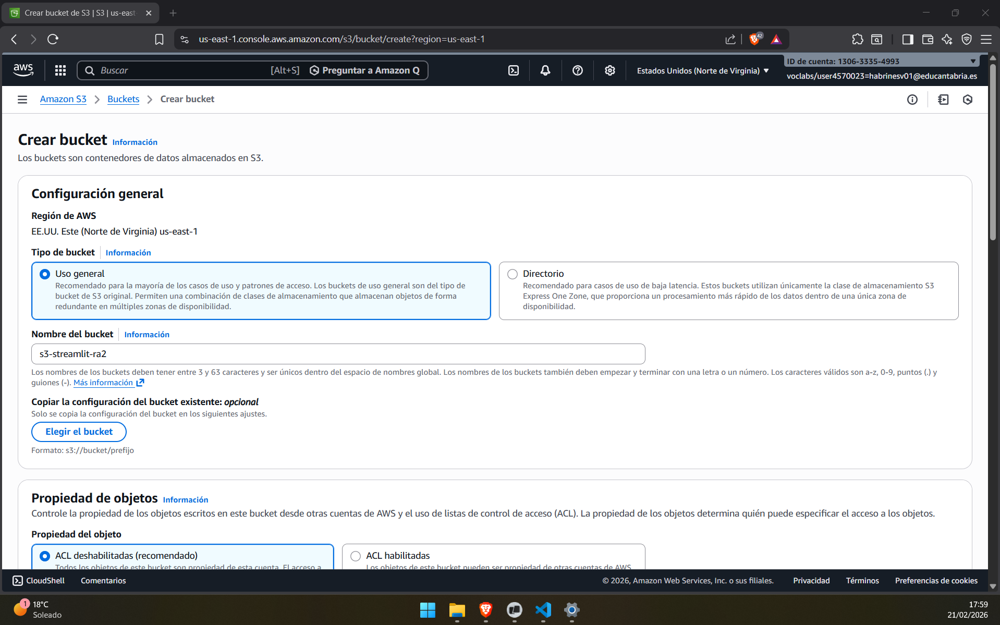

- [x] Captura/confirmación de que **no es público** (Block Public Access o permisos)
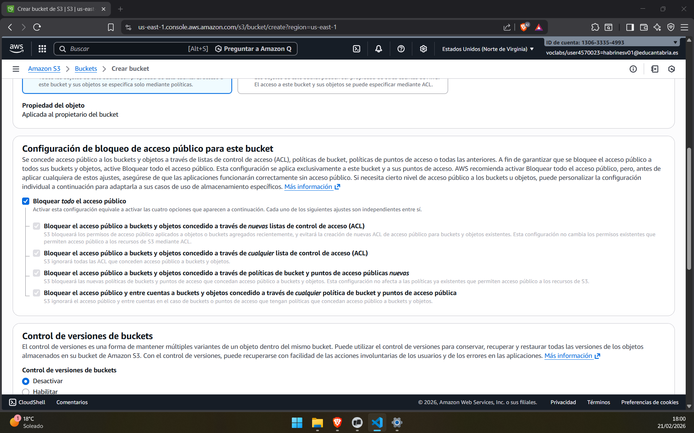

- [x] Captura del objeto JSON en `data/sensores/`
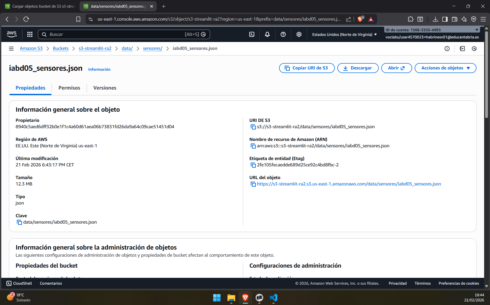

**Notas:**
- Key usada (S3_KEY): `s3://s3-streamlit-ra2/data/sensores/iabd05_sensores.json`

---

## 2) Notebook / Script de subida
- [x] Captura de la ejecución del notebook/script subiendo a S3
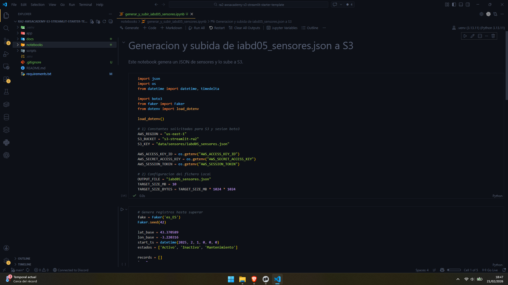
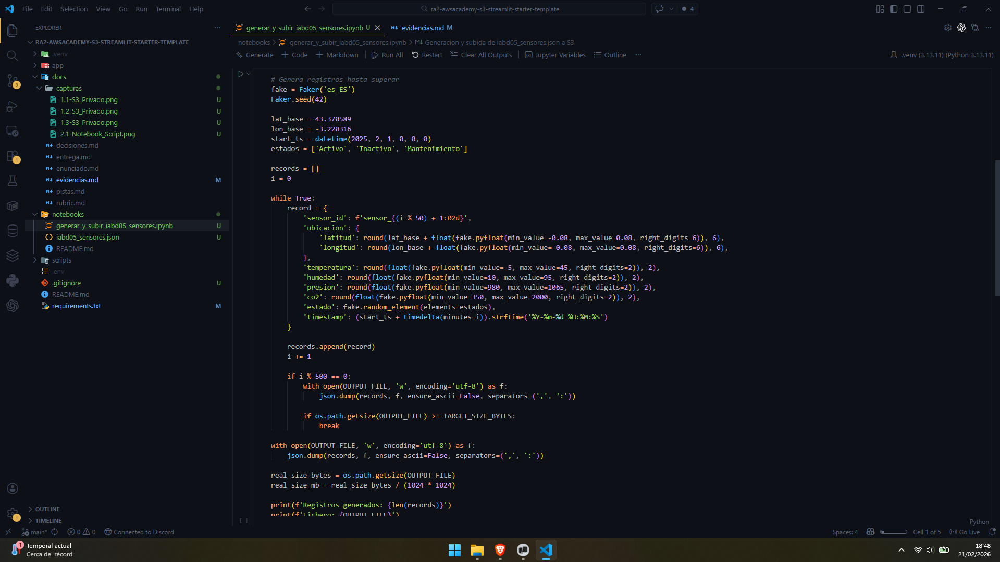
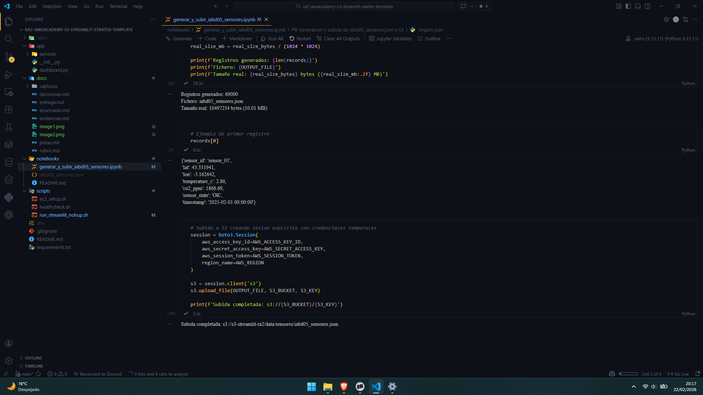

- [x] Enlace o ruta del archivo en el repo (`notebooks/...`)
`https://github.com/HenzeI/ra2-awsacademy-s3-streamlit-starter-template/tree/main/notebooks/generar_y_subir_iabd05_sensores.ipynb`
---

## 3) EC2 y red
- [x] Captura de la instancia EC2 (Ubuntu 22.04)
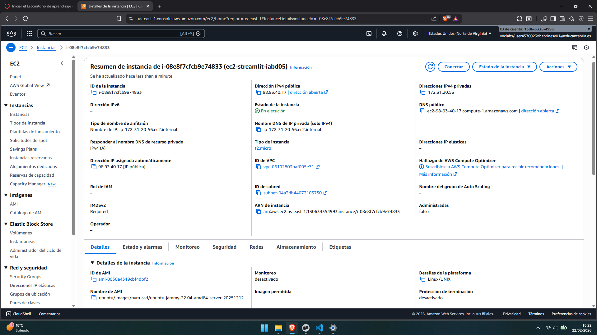

- [x] Captura del Security Group con puerto 8501 abierto (según reglas del lab)
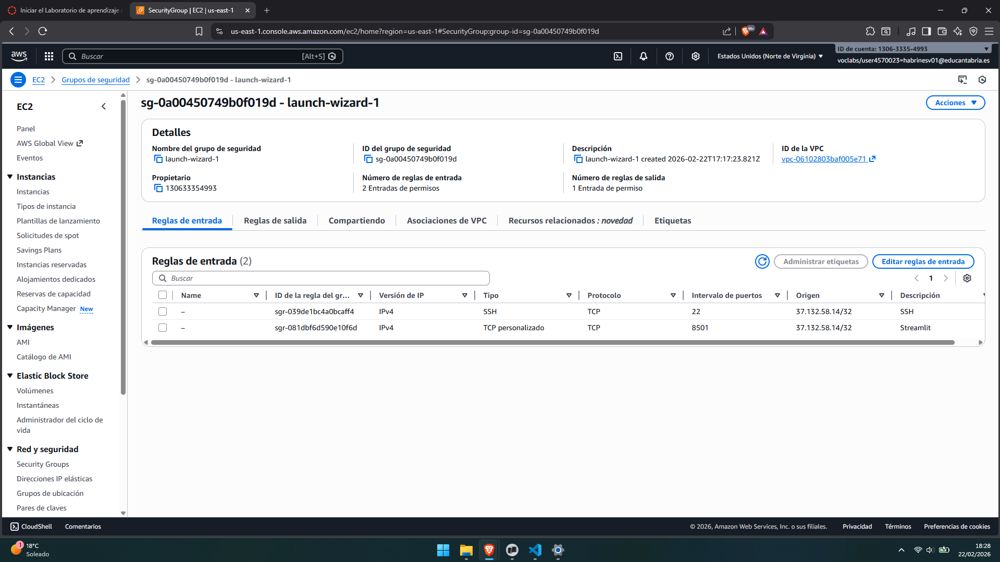

- [x] Salida de `ssh` conectando (sin mostrar claves)
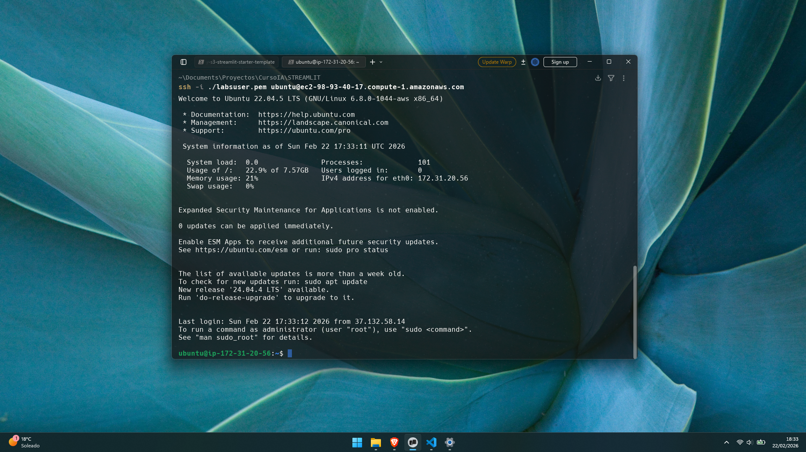

---

## 4) Acceso a S3 desde EC2 (sin secretos)
Ejecuta en EC2:

```bash
aws sts get-caller-identity
aws s3 ls s3://<BUCKET>/data/sensores/
```

- [x] Captura/salida de ambos comandos
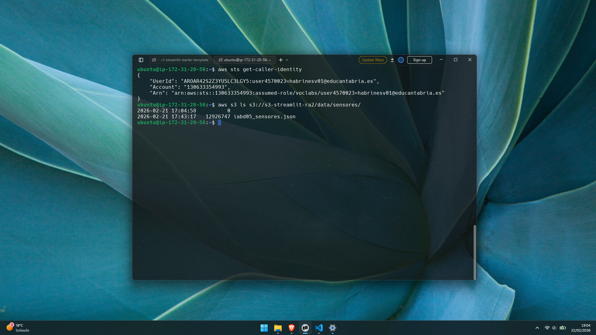

---

## 5) Streamlit en EC2
- [x] Captura de `streamlit hello` funcionando (o `python -c "import streamlit"`)
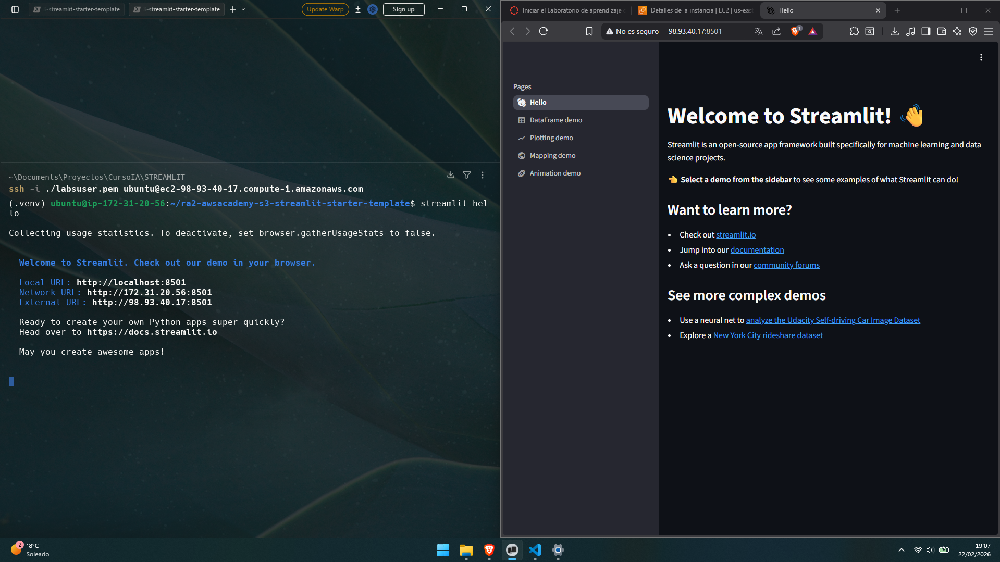

- [x] Captura de instalación de dependencias (`pip install -r requirements.txt`)
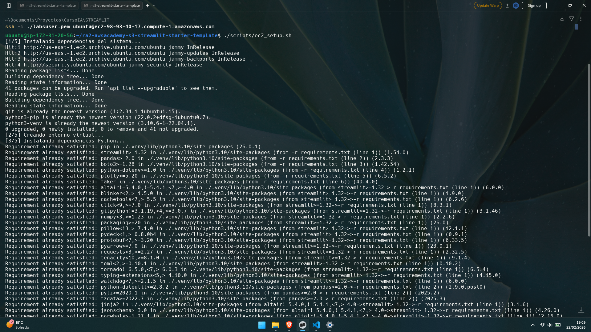
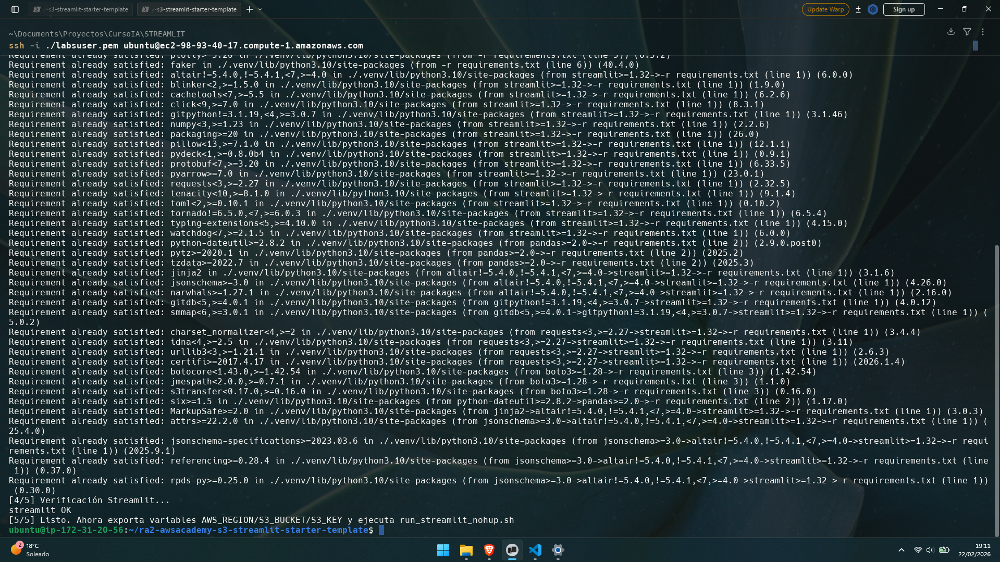

---

## 6) Dashboard (funcionalidad)
Incluye capturas donde se vea:

- [ ] Filtro por `sensor_state`
- [ ] Slider de temperatura
- [ ] Tabla filtrada
- [ ] Gráfica línea (temperatura vs tiempo)
- [ ] Gráfica barras (CO₂ por sensor)
- [ ] Mapa con sensores

---

## 7) Despliegue final
- [ ] Comando usado para arrancar en segundo plano (ej. `nohup` o script)
- [ ] Captura del log (`tail -n 50 streamlit.log` o similar)
- [ ] URL final:

**URL:** `http://IP_PUBLICA_EC2:8501`

- [ ] Captura en navegador accediendo a la URL

---

## 8) Observaciones (opcional)
- Problemas encontrados y solución:
